# D3 Volume Map
## 1. Overview
The D3 Volume Map was created for the public dashboard of the King Street Pilot, to present actual and percent change in volumes in major streets in the study area for which is there is data. The study area is bounded by Bathurst in the west, Jarvis in the east, Queen in the north, and Front in the south. 

The information below directly references the 3rd version of the D3 Volume Map, and the code for that can be found [here](https://github.com/CityofToronto/bdit_king_pilot_dashboard/blob/gh-pages/d3-volume_map/D3volumemap3.html). At times, `react.js` may be referenced, which specifically means the VolumeMap.react.js file located [here](https://github.com/CityofToronto/bdit_king_pilot_dashboard/blob/dash_components/src/components/VolumeMap.react.js).

## 2. Data
The D3 Volume Map takes in 3 different datasets:
1. `streets_lines3.csv` - full-length streets, point-to-point line, version 3
2. `streets_segments31.csv` - streets segmented by intersections with other streets, point-to-point line, version 3.1
3. `street_volumes.csv`, or other source - volume data tied to segment number and segment direction; `street_volumes.csv` is fake data


### `streets_lines3.csv` example

line|streetname|directions|x1|y1|x2|y2
----|----------|----------|--|--|--|--
1|Queen|EW|10|10|250|10
2|Richmond|W|10|20|250|20

### `streets_segments31.csv` example

segment|streetname|direction|segdesc|x1|y1|x2|y2
-------|----------|---------|-------|--|--|--|--
1|Queen|E|Bathurst to Portland|10|10|30|10
2|Queen|E|Portland to Spadina|30|10|60|10

### `street_volumes.csv` example

segment|direction|mon|time_period|volume|pct_change
-------|---------|---|-----------|------|----------
1|E|11/01/2017 0:00|AM|2380|13.42
2|E|11/01/2017 0:00|AM|2725|12.34

## 3. Major Components
The code for the D3 Volume Map is broken up into several different sections dedicated to different purposes, and groups functions for those purposes. The following describes the different sections and some functions of interest:

### HTML
In the standalone D3 Volume Map, the HTML code defines the style of the tooltip, sources D3.js scripts, and creates buttons that updates the displayed data. In the dashboard, a CSS file manages the style of the tooltip, and global controls in react.js and Python filter and update the data. 

### Prepare CSV Data
These functions define the object properties of the objects created from the D3.js CSV call. 

### Setup SVGs
These functions create the SVG container and the SVG groups that the paths will be drawn into. `labelgroup` holds street labels, `slnodata` holds street lines with no volume data, `slgroup` holds street lines with volume data, `ssgroup` holds street segments, and `legendgroup` holds legend components. 

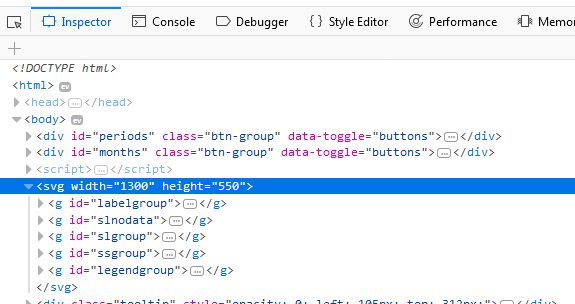

### Scale SVGs
This section creates the `scaling` function, which calculates the domain (original coordinate/size) and defines the range (new size), which are used by the `xScale` and `yScale` functions. 

### Get min/max segments coordinates
These functions get the min and max of x and y coordinates of all the street segments. 

### Create tooltip
In the standalone D3 Volume Map, this section creates the tooltip variable to be used later. In react.js, this section appears in the createVolumeMap function.

### Data filter functions
In the standalone D3 Volume Map, this section stores the values expected from the button controls, and creates a function that checks which buttons are selected. In react.js, this section does not exist as data filtering is handled on the Python side

### Colouring segments
This section defines the colour scale and `pctColour`, a function that determines which interval the volume data of a segment falls into. 

Interval|Colour
--------|------
Below -20|#4d9221
-20 to -10|#7fbc41
-10 to -5|#b8e186
-5 to 0|#e6f5d0
0 to 5|#fde0ef
5 to 10|#f1b6da
10 to 20|#de77ae
Over 20|#c51b7d
No Data|grey


### Functions to draw SVGs
This is the largest section of the document, and contains all the functions that create the paths of SVGs drawn. `pathFunc` generates the line paths for street lines, while `fancy` generates the polygon paths for street segments. `fancy` uses functions `outside` and `inside` to determine if a street segment is on the outer edges of the study area, or if it falls within those edge bounds. Together, `fancy`, `outside`, and `inside` draw the polygon paths, following the cases listed in the tables below. The red dots represent the street segment, and the blue dots are the other two points of the polygon. The arrows represent the direction the "pen" moves in order to draw the path. 

#### `outside`
Condition|Action
---------|------
End point is NW corner, and direction is W|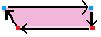
Start point is NW corner, and direction is S|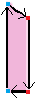
End point is SW corner, and direction is S|
Start point is SW corner, and direction is E|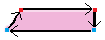
End point is NE corner, and direction is N|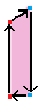
Start point is NE corner, and direction is W|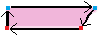
End point is SE corner, and direction is E|The study area does not have a southmost and eastmost point, so while the code to draw the SE corner exists, it is not used.
Start point is SE corner, and direction is N|The study area does not have a southmost and eastmost point, so while the code to draw the SE corner exists, it is not used.
Front EB to Front/Wellington and Jarvis corner|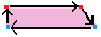
Jarvis NB to Front/Wellington and Jarvis corner|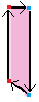
Else|function `inside`

#### `inside`
Condition|Action
---------|------
If there are 2 other segments touching the current segment|Both ends of the polygon are tapered<br>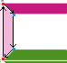
If there is 1 other segment touching the current segment|Determine which point of the current segment the other segment is touching, and then taper that end of the polygon<br>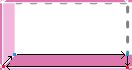<br>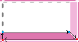
If there are no other segments touching the current segment|Draw the polygon as a rectangle<br>

The function `slpathGen` draws the street lines into `slnodata` or `slgroup`, while function `sspathGen` draws the street segments into `ssgroup`. `sspathGen` also creates the key for binding data to the appropriate segments, which is referenced in function `sspathUpdate`, which binds the data to the segment polygons, transitions colour change, and creates the tooltip that displays when the mouse hovers over a segment. `sspathUpdate` is called when a button is clicked. 

*gif of button click and tooltip*


### Functions to label SVGs
The function `labelStreets` takes the streets_lines data and creates text SVGs at the west-most and north-most ends of the streets, depending on the direction of the street. 

### Create a legend
The function `createLegend` creates the array of objects that defines the text, x, y, and colours, and displays the text and colour components of the legend. The symbols of the legend are technically very wide straight lines, and are not polygons. The legend is not scaled, so the size and position of the legend and its components are adjusted with hard numbers. 

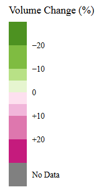

### Draw SVGs
In the standalone D3 Volume Map, the variables and functions that are immediately dependent on the external data are updated and called within the nested CSV calls. In react.js, this section appears in the createVolumeMap function.

## 4. Key Takeaways
The development of the D3 Volume Map had many challenges, but there were several lessons learned in regards to developing in Javascript and with D3.js.

### Working with external files with D3
Javascript runs scripts synchronously. This is important to keep in mind when working with external data and loading external files with D3, as the main data-loading functions (d3.csv, .tsv, .json, etc.) will also be called synchronously. Javascript functions immediately requiring the external data (functions that take the data as an argument, or refers to the loaded data within the function) will error because the data has not finished loading/been fully loaded. 

To ensure that functions requiring the external data are able to run without error, those functions should be defined _before_ the D3 data load, and called _within_ the data load. 

```Javascript
// Sample Code
var dataParser = function(d) {
	return {
		id: d.id,
		value: d.value
	};
};

function dataPrinter(arr) {
	arr.forEach(function(obj) {
		console.log(obj.id + " " + obj.value);
	};
}

var data;
d3.csv("filename.csv", function(d) {
	data = d.map(dataParser);
	dataPrinter(data);
};
```

### Global Variables and Built-In Array Functions
We have been learning Javascript throughout the project, and two good things to remember are: global variables make information accessible and allows easier testing and debugging of script; and built-in array functions (`map`, `filter`, and `reduce` are some popular ones) reduce the need to write your own array function (usually written using `for` loops or `forEach`). See the above sample for the use of `forEach` and `map`. 

D3.js also provides a built-in array function in the form of `.data`, which iterates through an array of objects and passes those objects to the functions chained after it (e.g. `.attr` with an anonymous function to access specific properties of the array's objects).  

### Using Anonymous Functions as Accessors of Data
D3 relies heavily on anonymous functions to access data, as data is often stored in the form of arrays of objects. Array functions help us access the objects, but anonymous functions help us quickly access the properties of the objects. Below is a sample from the D3 Volume Map script that uses several anonymous functions. 

```Javascript
d3.select("#legendgroup")
	.selectAll("line")
	.data(legendData.filter(function(d) {return d.text != legendText[0];}))
	.enter()
	.append("line")
	.attr("x1", function(d) {return d.x-40;})
	.attr("y1", function(d) {return d.y;})
	.attr("x2", function(d) {return d.x-9;})
	.attr("y2", function(d) {return d.y;})
	.attr("stroke", function(d) {return d.colour;})
	.attr("stroke-width", 40);
```

