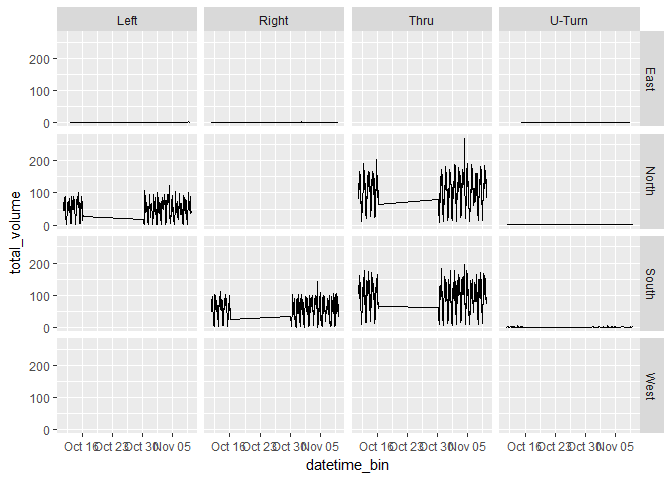

Exploratory Analysis - Miovision Counts
================
Aakash Harpalani
Thursday, December 14, 2017

### Setup

Loading libraries:

``` r
library(RPostgreSQL)
library(ggplot2)
library(lubridate)
library(dplyr)
```

Establishing connections and credentials:

``` r
drv <- dbDriver("PostgreSQL")
source("connect/connect.R")
```

### Analysis

Set intersection of interest:

``` r
intersection_id = 1
```

Retrieve 15-min count data:

``` r
strSQL <-
  paste0("SELECT intersection_name FROM miovision.intersections WHERE intersection_uid = ",intersection_id)
intersection_name <- dbGetQuery(con, strSQL)

strSQL <-
  paste0("SELECT datetime_bin, classification, leg, movement, volume ",
         "FROM miovision.volumes_15min ",
         "INNER JOIN miovision.classifications USING (classification_uid) ",
         "INNER JOIN miovision.movements USING (movement_uid) ",
         "WHERE intersection_uid = ",intersection_id," ",
         "ORDER BY datetime_bin, classification_uid, leg, movement ")
data <- dbGetQuery(con, strSQL)
```

Overall volumes, by class:

``` r
vol_by_class <- data %>%
  group_by(datetime_bin, classification) %>%
  summarize(total_volume = sum(volume))
head(vol_by_class)
```

    ## Source: local data frame [6 x 3]
    ## Groups: datetime_bin [1]
    ## 
    ##          datetime_bin        classification total_volume
    ##                <dttm>                 <chr>        <int>
    ## 1 2017-10-11 15:00:00    Articulated Trucks            1
    ## 2 2017-10-11 15:00:00 Bicycles on Crosswalk            2
    ## 3 2017-10-11 15:00:00      Bicycles on Road            4
    ## 4 2017-10-11 15:00:00                 Buses            8
    ## 5 2017-10-11 15:00:00                Lights          324
    ## 6 2017-10-11 15:00:00           Pedestrians           33

``` r
lights_by_dir <- data %>%
  group_by(datetime_bin, leg, movement) %>%
  filter(classification == 'Lights') %>%
  summarize(total_volume = sum(volume))
head(lights_by_dir)
```

    ## Source: local data frame [6 x 4]
    ## Groups: datetime_bin, leg [3]
    ## 
    ##          datetime_bin   leg movement total_volume
    ##                <dttm> <chr>    <chr>        <int>
    ## 1 2017-10-11 15:00:00 North     Left           44
    ## 2 2017-10-11 15:00:00 North     Thru           81
    ## 3 2017-10-11 15:00:00 South    Right           77
    ## 4 2017-10-11 15:00:00 South     Thru          122
    ## 5 2017-10-11 15:15:00 North     Left           54
    ## 6 2017-10-11 15:15:00 North     Thru           95

``` r
ggplot(data = vol_by_class, aes(x=datetime_bin, y=total_volume)) +
  geom_line() +
  facet_grid(classification ~ .)
```


``` r
lights_by_dir <- data %>%
  group_by(datetime_bin, leg, movement) %>%
  filter(classification == 'Lights') %>%
  summarize(total_volume = sum(volume))
head(lights_by_dir)
```

    ## Source: local data frame [6 x 4]
    ## Groups: datetime_bin, leg [3]
    ## 
    ##          datetime_bin   leg movement total_volume
    ##                <dttm> <chr>    <chr>        <int>
    ## 1 2017-10-11 15:00:00 North     Left           44
    ## 2 2017-10-11 15:00:00 North     Thru           81
    ## 3 2017-10-11 15:00:00 South    Right           77
    ## 4 2017-10-11 15:00:00 South     Thru          122
    ## 5 2017-10-11 15:15:00 North     Left           54
    ## 6 2017-10-11 15:15:00 North     Thru           95

``` r
ggplot(data = lights_by_dir, aes(x=datetime_bin, y=total_volume)) +
  geom_line() +
  facet_grid(leg ~ movement)
```

    ## geom_path: Each group consists of only one observation. Do you need to
    ## adjust the group aesthetic?


