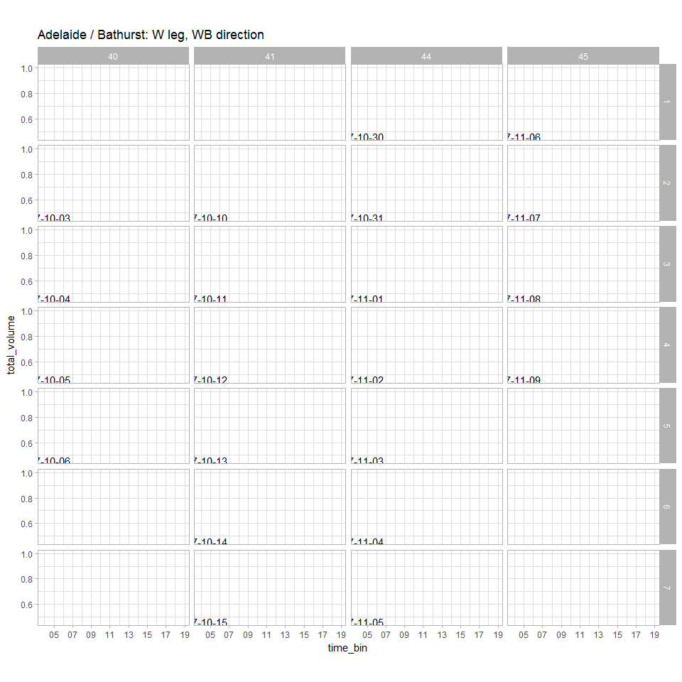

Exploratory Analysis - Miovision Counts
================
Aakash Harpalani
Thursday, December 14, 2017

### Setup

Loading libraries:

``` r
library(RPostgreSQL)
library(ggplot2)
library(lubridate)
library(dplyr)
```

Establishing connections and credentials:

``` r
drv <- dbDriver("PostgreSQL")
source("connect/connect.R")
```

### Analysis

Set intersection of interest:

``` r
intersection_id = 1
```

Retrieve 15-min count data:

``` r
strSQL <-
  paste0("SELECT intersection_name FROM miovision.intersections WHERE intersection_uid = ",intersection_id)
intersection_name <- dbGetQuery(con, strSQL)

strSQL <-
  paste0("SELECT datetime_bin, classification, leg, dir, volume ",
         "FROM miovision.volumes_15min ",
         "INNER JOIN miovision.classifications USING (classification_uid) ",
         "WHERE intersection_uid = ",intersection_id," ",
         "ORDER BY datetime_bin, classification_uid, leg, dir ")
data <- dbGetQuery(con, strSQL)
```

Overall volumes, by date/tod

``` r
all_vehicles <- data %>%
  group_by(datetime_bin, leg, dir) %>%
  filter(classification %in% c('Lights','Single-Unit Trucks','Articulated Trucks','Buses')) %>%
  summarize(total_volume = sum(volume))
head(all_vehicles)
```

    ## Source: local data frame [6 x 4]
    ## Groups: datetime_bin, leg [4]
    ## 
    ##          datetime_bin   leg   dir total_volume
    ##                <dttm> <chr> <chr>        <int>
    ## 1 2017-10-11 11:00:00     E    EB          127
    ## 2 2017-10-11 11:00:00     N    NB          131
    ## 3 2017-10-11 11:00:00     N    SB          136
    ## 4 2017-10-11 11:00:00     S    NB          211
    ## 5 2017-10-11 11:00:00     S    SB           89
    ## 6 2017-10-11 11:15:00     E    EB          147

``` r
all_vehicles$dt <- floor_date(all_vehicles$datetime_bin,'1 day')
all_vehicles$time_bin <- as.POSIXct(paste(sprintf("%02d",hour(all_vehicles$datetime_bin)),sprintf("%02d",minute(all_vehicles$datetime_bin)),sep=":"), format = "%H:%M")
all_vehicles$wk <- strftime(all_vehicles$dt,format='%W')
all_vehicles$dow <- strftime(all_vehicles$dt, format = '%u')
```

Plot all direction/leg combinations (Adelaide and Bathurst):

``` r
for (leg in c('N','S','W','E')){
  for (dir in c('NB','SB','EB','WB')){
    if (((leg %in% c('N','S')) && (dir %in% c('NB','SB'))) | ((leg %in% c('E','W')) && (dir %in% c('EB','WB')))){
      subset <- all_vehicles[all_vehicles$dir == dir & all_vehicles$leg == leg,]
      dates <- data.frame(label = unique(all_vehicles$dt))
      dates$dow <- strftime(dates$lab, format = '%u')
      dates$wk <- strftime(dates$lab, format = '%W')
      dates$x = as.POSIXct('04:00', format = '%H:%M')
      dates$y = max(0.96 * max(subset$total_volume), 0.95)
      
      print(ggplot(data = subset, aes(x=time_bin, y=total_volume)) +
        geom_line(aes(color = ifelse(dow < 6, "weekday", "weekend")), size = 1) +
        scale_colour_brewer(type = 'qua', palette = "Set1", direction = -1) +
        scale_x_datetime(date_labels = "%H", date_breaks = "2 hours") +
        facet_grid(dow ~ wk) +
        geom_text(data = dates, aes(x,y-0.5,label=label)) +
        theme_light() + 
        guides(color = F) +
        theme(aspect.ratio = 1/2) +
        labs(title = paste0(intersection_name,": ", leg, " leg, ", dir, " direction")),
        width = 700, height = 1400)
    }
  }
}
```


    ## geom_path: Each group consists of only one observation. Do you need to
    ## adjust the group aesthetic?


    ## geom_path: Each group consists of only one observation. Do you need to
    ## adjust the group aesthetic?



    ## geom_path: Each group consists of only one observation. Do you need to
    ## adjust the group aesthetic?


