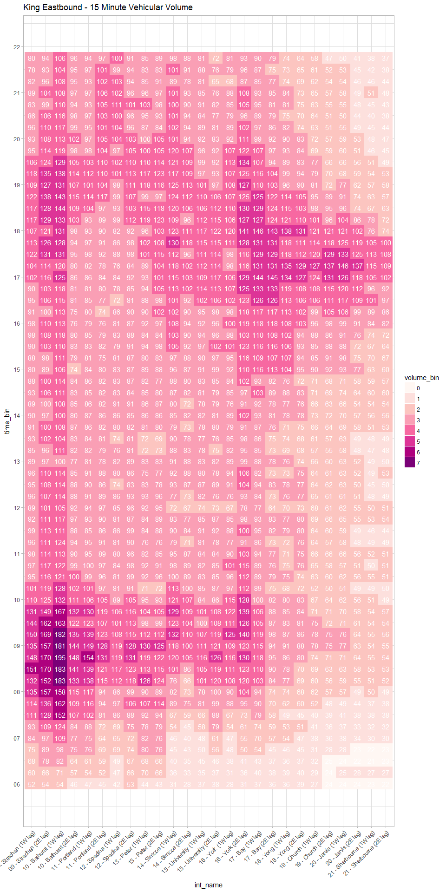
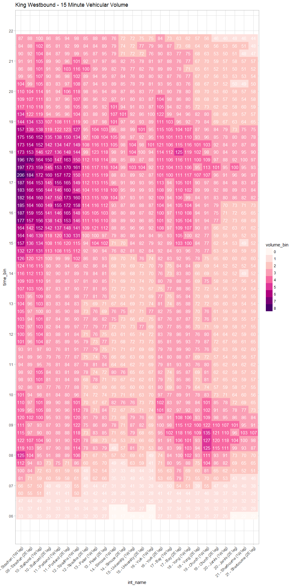

Spatial Comparison - Miovision Counts
================
Aakash Harpalani
Monday, January 8, 2017

### Setup

Loading libraries:

``` r
library(RPostgreSQL)
library(ggplot2)
library(lubridate)
library(dplyr)
```

Establishing connections and credentials:

``` r
drv <- dbDriver("PostgreSQL")
source("connect/connect.R")
```

### Analysis

Retrieve baselines (King EB):

``` r
strSQL <-
  paste0("SELECT A.time_bin, A.intersection_uid, B.street_main, B.street_cross, A.leg, SUM(volume) as total_volume ",
         "FROM miovision.baselines A ",
         "INNER JOIN miovision.intersections B USING (intersection_uid) ",
         "WHERE intersection_uid >= 9 AND intersection_uid <= 21 AND A.dir = 'EB' AND A.classification_uid IN (1,4,5) AND EXTRACT(HOUR FROM A.time_bin) >= 6 AND EXTRACT(HOUR FROM A.time_bin) < 22",
         "GROUP BY A.time_bin, A.intersection_uid, B.street_main, B.street_cross, A.leg ",
         "ORDER BY A.time_bin, A.intersection_uid, A.leg desc")
data <- dbGetQuery(con, strSQL)
data$int_name <- paste0(sprintf("%02d",data$intersection_uid),' - ', data$street_cross, ' (', ifelse(data$leg=='W','1W','2E'), ' leg)')
data$time_bin <- as.POSIXct(data$time_bin, format = '%H:%M:%S')

data$volume_bin <- as.factor(floor(data$total_volume / 25))
```

Spatial Comparison (King EB):

``` r
ggplot(data = data, aes(y=time_bin, x=int_name)) +
  geom_tile(aes(fill = volume_bin)) +
  geom_text(aes(label = round(total_volume,0)), colour = "white") +
  scale_fill_brewer(palette = "RdPu") +
  scale_y_datetime(date_labels = "%H", date_breaks = "1 hour") +
  theme_light() +
  theme(axis.text.x = element_text(angle = 45, hjust = 1)) +
  labs(title = 'King Eastbound - 15 Minute Vehicular Volume')
```



Retrieve baselines (King WB):

``` r
strSQL <-
  paste0("SELECT A.time_bin, A.intersection_uid, B.street_main, B.street_cross, A.leg, SUM(volume) as total_volume ",
         "FROM miovision.baselines A ",
         "INNER JOIN miovision.intersections B USING (intersection_uid) ",
         "WHERE intersection_uid >= 9 AND intersection_uid <= 21 AND A.dir = 'WB' AND A.classification_uid IN (1,4,5) AND EXTRACT(HOUR FROM A.time_bin) >= 6 AND EXTRACT(HOUR FROM A.time_bin) < 22",
         "GROUP BY A.time_bin, A.intersection_uid, B.street_main, B.street_cross, A.leg ",
         "ORDER BY A.time_bin, A.intersection_uid, A.leg desc")
data <- dbGetQuery(con, strSQL)
data$int_name <- paste0(sprintf("%02d",data$intersection_uid),' - ', data$street_cross, ' (', ifelse(data$leg=='W','1W','2E'), ' leg)')
data$time_bin <- as.POSIXct(data$time_bin, format = '%H:%M:%S')

data$volume_bin <- as.factor(floor(data$total_volume / 25))
```

Spatial Comparison (King WB):

``` r
ggplot(data = data, aes(y=time_bin, x=int_name)) +
  geom_tile(aes(fill = volume_bin)) +
  geom_text(aes(label = round(total_volume,0)), colour = "white") +
  scale_fill_brewer(palette = "RdPu") +
  scale_y_datetime(date_labels = "%H", date_breaks = "1 hour") +
  theme_light() +
  theme(axis.text.x = element_text(angle = 45, hjust = 1)) +
  labs(title = 'King Westbound - 15 Minute Vehicular Volume')
```


